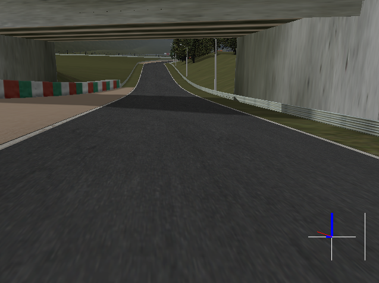

# TD3 Racing Driver



*Agent `v53_a` driving on `road/wheel-2` (Suzuka)*

---

## Introduction

### Project

This is my dissertation project for my MSc Computer Science at the University of Bath, titled **Developing Resilient Autonomous Vehicles with Deep Reinforcement Learning**. The idea was to research the use of deep reinforcement learning (DRL) for car control in unfamiliar environments or low-grip situations. [TD3](https://arxiv.org/pdf/1802.09477.pdf) is the DRL algorithm used.

The trained agents in `/agents/` - particularly `v53_a` and `v53_g_1` - show good performance on a variety of tracks, including ones they have not seen before.

This project builds on many other works referenced in the dissertation document, but chief among them are:

- [Deep deterministic policy gradient (DDPG)](https://arxiv.org/abs/1509.02971)
- [Twin delayed deep deterministic policy gradient (TD3)](https://arxiv.org/pdf/1802.09477.pdf)
- [The Open Racing Car Simulator (TORCS)](https://sourceforge.net/projects/torcs/)
- [Visual TORCS (vTORCS)](https://github.com/giuse/vtorcs/tree/nosegfault)
- Gym-TORCS ([original](https://github.com/ugo-nama-kun/gym_torcs), and [later fork](https://github.com/dosssman/GymTorcs))

### Repository

This repository contains both the dissertation document itself (`/docs/dissertation.pdf`), and the source code required to run the simulations reported on in the document (`/src/...`). The simulation in question is [TORCS](https://sourceforge.net/projects/torcs/).

## Development

### Requirements

This guide assumes you are **using Ubuntu 20.04**, since Linux is the only common supported OS of all the software required. You will also need a [CUDA-compatible discrete GPU](https://developer.nvidia.com/cuda-gpus) if you want to use `keras-gpu`. You will need to install the proper Nvidia driver, as well as the CUDA toolkit, and ensure that you use `keras-gpu` rather than `keras`.

It is recommended to use [Anaconda](https://www.anaconda.com/products/individual) to manage your environment. [PyCharm Professional](https://www.jetbrains.com/lp/pycharm-anaconda/) integrates with Conda environments conveniently, although it requires a licence. You can use the `msc-cpu.yml` file in this repository to prepare your environment (see below).

### Preparation

Ensure submodules exist after clone:

```bash
git submodule update --init --recursive
```

#### TORCS

Next, build the modified TORCS binary:

```bash
cd src/GymTorcs
sudo bash deps_install_script
```

You will then need to change three hardcoded config paths that were built by the installation script, in:

- `gym_torqs/vtorcs-RL-colors/src/interfaces/graphic.h`
- `gym_torqs/vtorcs-RL-colors/src/inferfaces/playerpref.h`

Change these from `/home/z3r0/...` to use your username e.g. `/home/eddie/...`. See [here](https://github.com/dosssman/GymTorcs/issues/2#issuecomment-651489409) for more details.

After this, you will need to run the last couple of steps in the installation script by hand to recompile `vtorcs-RL-colors`:

```bash
cd src/gym_torqs/vtorcs-RL-colors
./configure
make
sudo make install
sudo make datainstall
```

#### Python

Choose one of the following options, before moving on to *Linking Gym-Torcs*.

##### Option 1: CPU Only

Create your Conda environment from the file provided:

```bash
conda env create --file msc-cpu.yml
conda activate msc-cpu
```

##### Option 2: GPU

Verify that you have the correct driver installed for your GPU - this is easiest to do in *Software & Updates* in the Additional Drivers tab.

Create your Conda environment from the file provided:

```bash
conda env create --file msc-gpu.yml
conda activate msc-gpu
```

##### Linking Gym-Torcs

The last step is to link the local package provided by `gym_torcs` to your Conda environment.

```bash
conda activate {{your env here}}
cd src/GymTorcs
pip install -e .
```

If you want to change the Conda environment you are using - e.g. to go from CPU to GPU - you will need to restart your machine before this step will work. There is some kind of temporary link/file saved somewhere that gets lost on restart. This also means this link may not survive a machine restart.

### Running Experiments

Run the model using your Conda environment with the following:

```bash
python src/main.py
```

This will run experiments configured in `main.py`, with the core TORCS config present in `src/GymTorcs/gym_torcs/raceconfigs/default.xml`. Results and weights will be loaded from and saved to `/agents/`.

## Validation

Although the experiment code does its best to ensure determinism, models trained and then validated on GPU will not behave consistently, owing to nondeterministic consumption of the random seeds. To ensure deterministic behaviour, you must run the validation episode [with GPU disabled](https://keras.io/getting_started/faq/#how-can-i-obtain-reproducible-results-using-keras-during-development). There is a script to let you do this without wrangling Conda environments:

```bash
./run_cpu.sh
```

>It is not clear at the time of writing why this allows you to reproduce the final *training* result of a model trained under GPU. This is counter-intuitive, but not a priority for investigation.
